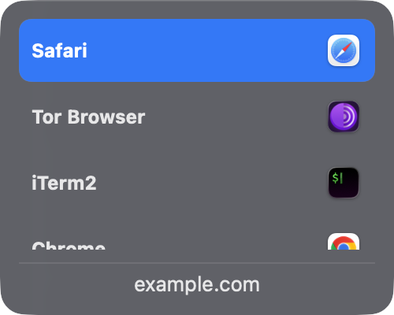
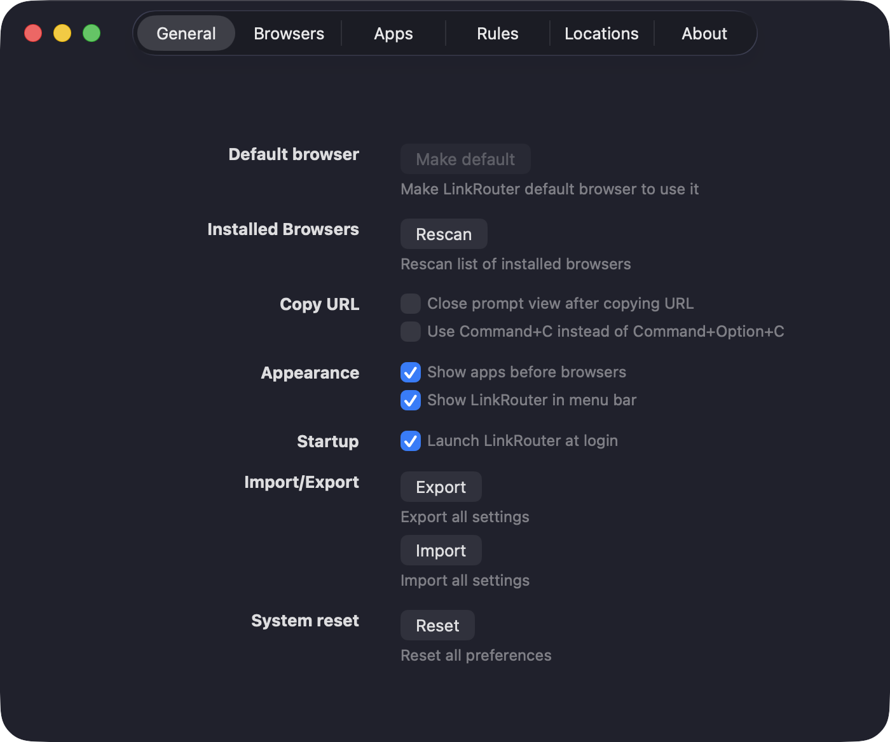

# LinkRouter


<p align="center">
  <a href="https://github.com/indranandjha1993/LinkRouter/actions/workflows/ci.yml"></a>
  <a href="https://github.com/indranandjha1993/LinkRouter/releases/latest"></a>
  <a href="https://github.com/indranandjha1993/LinkRouter/releases"></a>
  
  <a href="LICENSE"></a>
</p>

**LinkRouter** is a tiny, fast browser router for macOS written in SwiftUI. Set it as your default browser, and every link you click outside a browser pops up a picker — routing the link to the browser (or browser profile) you choose, with keyboard shortcuts and URL-based rules for automatic routing.

## Features

- ⚡ Native SwiftUI — instant popup, tiny footprint, no Electron
- ⌨️ Assign a keyboard shortcut to each browser
- 🎯 Rules — route matching URLs (regex) to a browser automatically, no prompt
- 👤 Supports browser profiles
- 🖥 macOS Ventura (13) and newer, Apple Silicon and Intel

## In action

| The picker | Preferences |
|:---:|:---:|
|  |  |

Click a link anywhere outside a browser — the picker appears. Choose with the mouse, arrow keys, or a per-browser shortcut, or let a rule route it automatically.

## Installation

### Homebrew

```bash
brew tap indranandjha1993/tap
brew install --cask linkrouter
xattr -dr com.apple.quarantine /Applications/LinkRouter.app
```

The `xattr` step clears Gatekeeper quarantine — releases are ad-hoc signed, not notarized with an Apple Developer certificate. Alternatively, download from the [releases page](https://github.com/indranandjha1993/LinkRouter/releases) and allow the app under **System Settings → Privacy & Security**.

### Set as default browser

Open LinkRouter once, then go to **System Settings → Desktop & Dock → Default web browser** and choose LinkRouter. From then on, links clicked in any app open the picker.

## Build from source

```bash
git clone https://github.com/indranandjha1993/LinkRouter.git
cd LinkRouter
xcodebuild -project LinkRouter.xcodeproj -scheme LinkRouter -configuration Release build
```

Requires Xcode 26 or newer.

## Credits

LinkRouter is a fork of [**Browserino**](https://github.com/AlexStrNik/Browserino) by [Aleksandr Strizhnev (AlexStrNik)](https://github.com/AlexStrNik) — full credit for the original design and implementation belongs to him and the Browserino contributors. The complete upstream commit history is preserved in this repository. If you find this app useful, consider [supporting the original author](https://alexstrnik.gumroad.com/l/browserino).

Browserino itself was inspired by [Browserosaurus](https://github.com/will-stone/browserosaurus).

## License

[GPL-3.0](LICENSE) — same license as upstream Browserino, as required. You are free to use, study, modify, and redistribute this software under the same terms.
